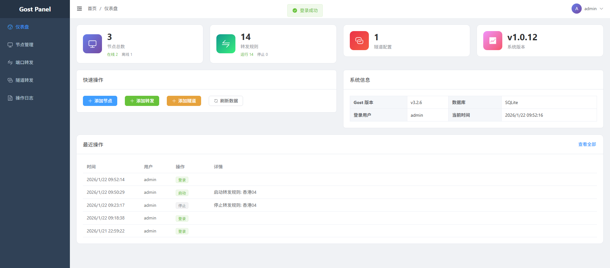
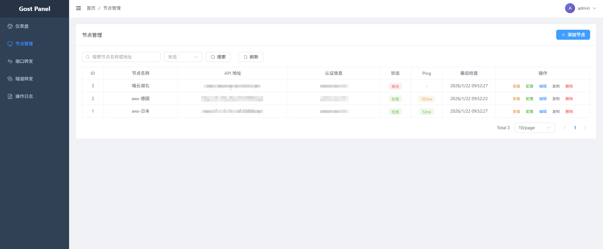
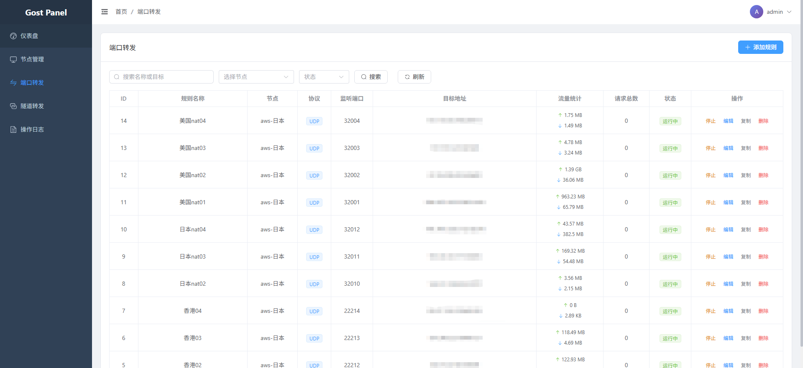
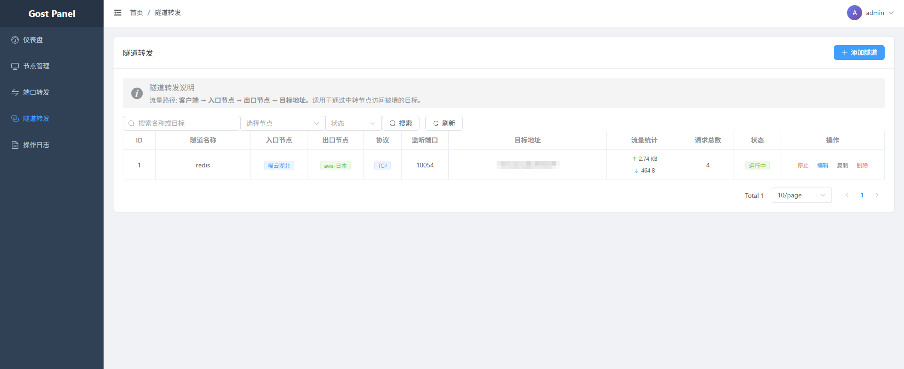

# Gost Panel

<div align="center">

**现代化 Gost v3 端口转发管理面板**

[](./LICENSE)
[](https://www.docker.com/)
[](https://golang.org/)

</div>

---

## 🚀 核心特性

- ⚡ **极简管理** - 统一管理多个 Gost 节点及其转发规则。
- 🔗 **多跳隧道** - 支持复杂的出口/中转隧道配置（入口 -> 出口 -> 目标）。
- 📊 **实时延迟** - 每 5 秒自动检测节点与转发链路的 Ping 值。
- 🛡️ **安全可靠** - 支持 API 认证，内置操作审计日志。
- 🐳 **快速部署** - 全量支持 Docker 一键运行及 GitHub Action 自动构建。

## 🛠️ 快速开始

### 1. 部署面板

**方式 A: Docker (推荐)**
确保已安装 Docker 和 Docker Compose，然后运行：
```bash
curl -sSL https://raw.githubusercontent.com/apicoder-peng/gostPanel/master/docker-compose.yml -o docker-compose.yml
docker-compose up -d
```

**方式 B: 二进制脚本 (原生部署)**
适用于没有 Docker 的 Linux 服务器（要求内存 > 128MB）：

**默认安装 (端口 39100):**
```bash
bash <(curl -sSL https://raw.githubusercontent.com/apicoder-peng/gostPanel/master/scripts/install_panel.sh)
```

**自定义端口 (例如 8080):**
```bash
bash <(curl -sSL https://raw.githubusercontent.com/apicoder-peng/gostPanel/master/scripts/install_panel.sh) 8080
```
或者
```bash
bash <(curl -sSL https://raw.githubusercontent.com/apicoder-peng/gostPanel/master/scripts/install_panel.sh) install --port 8080
```

**卸载面板:**
```bash
bash <(curl -sSL https://raw.githubusercontent.com/apicoder-peng/gostPanel/master/scripts/install_panel.sh) uninstall
```

**卸载节点:**
```bash
bash <(curl -sSL https://raw.githubusercontent.com/apicoder-peng/gostPanel/master/scripts/install_node.sh) uninstall
```

---

## 📸 界面预览

<table>
  <tr>
    <td align="center">
      <h3>仪表板</h3>
      
    </td>
    <td align="center">
      <h3>节点管理</h3>
      
    </td>
  </tr>
  <tr>
    <td align="center">
      <h3>转发管理</h3>
      
    </td>
    <td align="center">
      <h3>隧道管理</h3>
      
    </td>
  </tr>
</table>

---

## 📡 添加转发节点

1. 在面板导航至 **节点管理**。
2. 点击已有节点的 **安装** 按钮，或者点击 **添加节点**。
3. 复制生成的安装命令，在目标服务器上运行即可完成自动化部署。

---

## 📦 预编译下载

项目支持多平台二进制发布，请访问 [Releases](https://github.com/apicoder-peng/gostPanel/releases) 下载：
- **Linux**: amd64, arm64
- **Windows**: amd64
- **macOS**: Apple Silicon, Intel

### 开发与编译
如果你想自行编译单二进制文件：

**使用 Makefile（推荐）**：
```bash
# 完整构建（前端+后端）
make build

# 只构建前端
make build-web

# 只构建后端
make build-server

# 清理构建产物
make clean

# 构建多平台发布版本
make release
```

---

## 🤝 声明
本项目仅供学习与科研使用，请在法律范围内使用。

**Star 也是一种支持！⭐**
