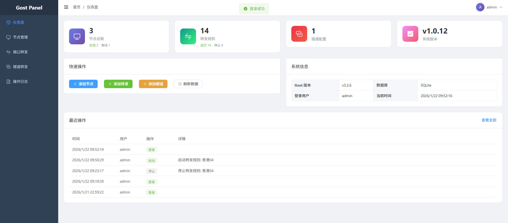
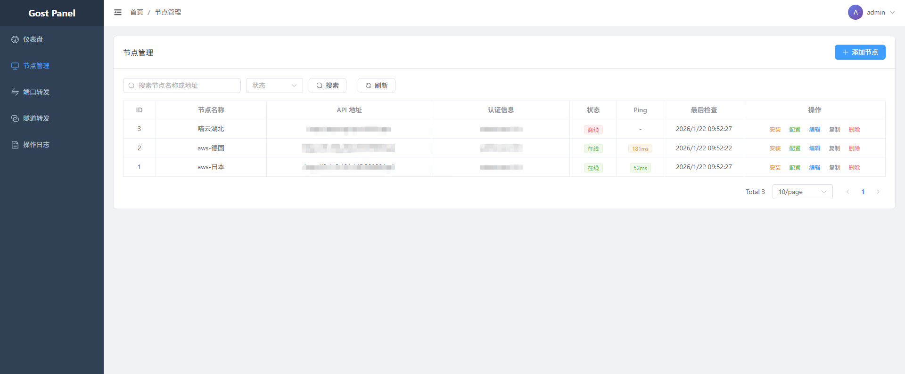
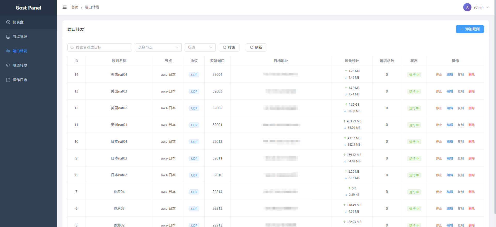
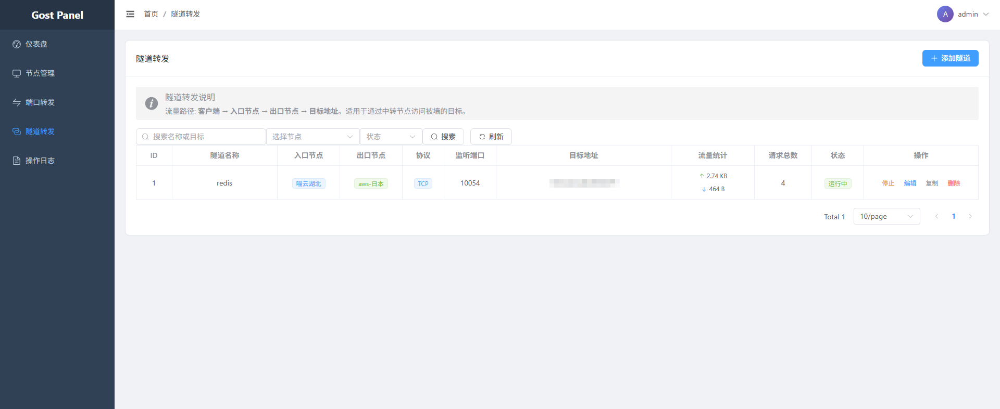

# Gost Panel

<div align="center">

**现代化 Gost v3 端口转发管理控制面板**

[](./LICENSE)
[](https://github.com/openbmx/gostPanel-master/releases)
[](https://github.com/openbmx/gostPanel-master/actions/workflows/release.yml)
[](https://github.com/openbmx/gostPanel-master/pkgs/container/gostpanel)
[](https://go.dev/)
[](https://vuejs.org/)

</div>

---

## 📖 简介

**Gost Panel** 是一个功能强大的可视化管理面板，专为 [Gost v3](https://github.com/go-gost/gost) 安全隧道工具设计。它旨在简化复杂的网络转发配置，提供直观的 Web 界面来统一管理多台服务器节点、配置端口转发规则、监控链路延迟，并支持复杂的多级代理隧道链。

> 所有发布产物（二进制 / Docker 镜像）均由本仓库的 GitHub Actions 自动编译并托管在 **GitHub Releases** 与 **GHCR**，不依赖任何第三方下载源。

## ✨ 核心特性

- ⚡ **统一节点管理** - 在一个面板集中管理所有 Gost 客户端节点。
- 🔄 **灵活转发规则** - 支持 TCP/UDP 端口转发，简单易用。
- 🔗 **高级隧道编排** - 支持复杂的多跳隧道链路（入口 -> 中转 -> 出口）配置。
- 📊 **实时流量与状态监控** - 基于 Gost Observer 的实时流量统计，定时检测节点连通性及链路延迟（Ping）。
- 🛡️ **安全与审计** - 内置 JWT 认证机制、随机化默认密钥，记录完整的用户操作日志。
- 🐳 **容器化支持** - 原生支持 Docker 及 Docker Compose 一键部署。

## 📸 界面预览

| 仪表盘 | 节点管理 |
| :---: | :---: |
|  |  |
| **转发规则** | **隧道管理** |
|  |  |

## 🚀 快速部署

### 默认账户
> ⚠️ 部署后请务必修改默认密码，并设置强随机 `JWT Secret`！
- **访问地址**: `http://IP:39100` （默认端口）
- **用户名**: `admin`
- **密码**: 一键脚本部署时随机生成；手动/Docker 部署默认 `admin123`（请立即修改）

### ⭐ 方式 0：一键管理脚本（最简单，推荐新手）

一个交互式菜单脚本，集成了**安装、升级、卸载、启停、状态查看、日志**等全部常用功能，服务端与节点都能管。运行后按数字选择即可：

```bash
bash <(curl -sSL https://raw.githubusercontent.com/openbmx/gostPanel-master/main/scripts/gost.sh)
```

菜单功能一览：

| 选项 | 功能 | 说明 |
| :--: | :--- | :--- |
| 1 | 安装/重装服务端 | 可自定义端口，自动生成管理员密码 |
| 2 | 升级服务端 | **保留配置与数据库**，失败自动回滚 |
| 3 | 卸载服务端 | 可选择是否保留数据 |
| 4 | 查看服务端信息 | 显示访问地址、版本、状态 |
| 5 | 安装/重装节点 | 可自定义端口与 API 账号 |
| 6 | 升级节点 | **保留账号配置**，兼容 systemd/OpenRC |
| 7 | 卸载节点 | — |
| 8~11 | 启动/停止/重启/查看日志 | 服务端与节点通用 |

> 国内网络可加速：`GH_PROXY="https://ghfast.top/" bash <(curl -sSL .../gost.sh)`

如需手动控制每一步，也可使用下面的独立脚本：

### 方式 A：Docker Compose（推荐）

镜像托管于 GitHub Container Registry：`ghcr.io/openbmx/gostpanel:latest`

1. **获取 compose 文件**
   ```bash
   curl -sSL https://raw.githubusercontent.com/openbmx/gostPanel-master/main/docker-compose.yml -o docker-compose.yml
   ```

2. **（强烈建议）设置环境变量**

   编辑 `docker-compose.yml`，取消注释并填写：
   ```yaml
   environment:
     - GOSTPANEL_JWT_SECRET=<足够随机的长字符串>
     - GOSTPANEL_ADMIN_PASSWORD=<你的强密码>
   ```

3. **启动服务**
   ```bash
   docker compose up -d
   ```

### 方式 B：一键安装脚本（Linux）

适用于裸机部署，二进制直接从 GitHub Releases 下载。

**默认安装（端口 39100）:**
```bash
bash <(curl -sSL https://raw.githubusercontent.com/openbmx/gostPanel-master/main/scripts/install_panel.sh)
```

**自定义端口（例如 8080）:**
```bash
bash <(curl -sSL https://raw.githubusercontent.com/openbmx/gostPanel-master/main/scripts/install_panel.sh) 8080
```

> 国内网络访问 GitHub 较慢时，可在命令前加上加速前缀，例如：
> ```bash
> GH_PROXY="https://ghfast.top/" bash <(curl -sSL .../install_panel.sh)
> ```

### 方式 C：手动下载二进制

前往 [Releases 页面](https://github.com/openbmx/gostPanel-master/releases) 下载对应平台压缩包（`gost-panel-linux-amd64.tar.gz` 等），解压后运行：
```bash
tar -zxf gost-panel-linux-amd64.tar.gz
./gost-panel-linux-amd64
```

### 常用管理命令

**卸载面板:**
```bash
bash <(curl -sSL https://raw.githubusercontent.com/openbmx/gostPanel-master/main/scripts/install_panel.sh) uninstall
```

**被控端 (Agent) 卸载:**
```bash
bash <(curl -sSL https://raw.githubusercontent.com/openbmx/gostPanel-master/main/scripts/install_node.sh) uninstall
```

## ⬆️ 在线升级

升级脚本**只替换二进制，完整保留配置文件与数据库**，并在升级前自动备份、升级后健康检查，若失败会自动回滚到旧版本，不影响现有功能与数据。

**升级服务端（主控）到最新版:**
```bash
bash <(curl -sSL https://raw.githubusercontent.com/openbmx/gostPanel-master/main/scripts/upgrade_panel.sh)
```

**升级到指定版本 / 使用加速:**
```bash
VERSION=v1.2.0 GH_PROXY="https://ghfast.top/" \
  bash <(curl -sSL https://raw.githubusercontent.com/openbmx/gostPanel-master/main/scripts/upgrade_panel.sh)
```

**升级被控端节点（GOST，兼容 systemd / OpenRC）:**
```bash
# 默认升级到脚本内置 GOST 版本，可用 GOST_VERSION 指定
GOST_VERSION=3.2.6 \
  bash <(curl -sSL https://raw.githubusercontent.com/openbmx/gostPanel-master/main/scripts/upgrade_node.sh)
```

> 升级机制说明：
> - 旧二进制备份为 `*.bak.<时间戳>`，数据库/配置同样自动备份；确认无误后可手动删除。
> - 服务端健康检查通过 `http://127.0.0.1:<端口>/api/v1/health`；节点检查服务存活与 API 端口监听。
> - Docker 部署的升级方式：`docker compose pull && docker compose up -d`（数据通过卷持久化，不会丢失）。

## 🔐 环境变量配置

面板支持通过 `GOSTPANEL_` 前缀的环境变量覆盖 `config/config.yaml` 中的任意配置（适合 Docker / systemd 部署）：

| 环境变量 | 说明 |
| :--- | :--- |
| `GOSTPANEL_SERVER_PORT` | 监听地址，如 `:39100` |
| `GOSTPANEL_JWT_SECRET` | JWT 签名密钥（**生产环境必填**，留空将自动生成随机密钥） |
| `GOSTPANEL_ADMIN_USERNAME` | 初始管理员用户名 |
| `GOSTPANEL_ADMIN_PASSWORD` | 初始管理员密码 |
| `GOSTPANEL_DATABASE_PATH` | SQLite 数据库文件路径 |
| `GOSTPANEL_LOG_LEVEL` | 日志级别（debug/info/warn/error） |

> 若未配置 `JWT_SECRET` 或仍使用弱默认值，启动时会在 stderr 打印安全告警并自动生成随机密钥（重启后已签发的 Token 会失效）。

## 🕹️ 使用指南

### 添加节点 (Agent)

Gost Panel 采用 "服务端 - 客户端" 架构。您需要将其他服务器作为“节点”添加到面板中。

1. 登录 Gost Panel。
2. 进入 **节点管理** 页面。
3. 点击 **添加节点**，获取该节点的安装命令。
4. 在目标服务器（VPS）上执行复制的命令即可自动注册上线。

---

## 🛠️ 本地开发与构建

如果您想参与开发或自行编译：

### 环境要求
- Go 1.23+
- Node.js 18+ (包含 npm)

### 构建命令
项目根目录下提供了 `Makefile` 方便操作：

```bash
# 1. 编译前端和后端 (生成二进制文件 gost-panel)
make build

# 2. 仅编译前端
make build-web

# 3. 仅编译后端
make build-server

# 4. 运行开发模式
make run

# 5. 一键编译多平台发布产物（与 CI 一致）
make release VERSION=v1.0.0
```

### 持续集成 / 发布

- `.github/workflows/build.yml`：推送到 `main` 时自动编译并上传构建产物（artifact）。
- `.github/workflows/release.yml`：推送 `v*` tag 时自动编译多平台二进制并发布到 GitHub Releases。
- `.github/workflows/docker.yml`：推送 `v*` tag 时自动构建并推送多架构镜像到 GHCR。

发布新版本只需打 tag：
```bash
git tag v1.0.0
git push origin v1.0.0
```

### 配置文件
默认配置文件位于 `config/config.yaml`。您可以在此修改端口、数据库设置和日志级别，也可使用上文的环境变量覆盖。

## 📄 开源许可证

本项目基于 [MIT License](./LICENSE) 开源。
